# Car Rental Operations Platform

Platforma operacyjna do zarządzania wypożyczalnią samochodów — od rezerwacji, przez wydanie i zwrot pojazdu, po dokumentację PDF i rozliczenia. Zoptymalizowana pod małe i średnie firmy (~15 pojazdów, 1–5 pracowników), z naciskiem na mobilne workflow terenowe.

---

## Spis treści

- [Funkcjonalności](#funkcjonalności)
- [Stack technologiczny](#stack-technologiczny)
- [Architektura](#architektura)
- [Schemat bazy danych](#schemat-bazy-danych)
- [Uruchomienie lokalne](#uruchomienie-lokalne)
- [Testy](#testy)
- [Struktura projektu](#struktura-projektu)
- [Panel operacyjny](#panel-operacyjny)
- [CI/CD](#cicd)
- [Roadmapa](#roadmapa)

---

## Funkcjonalności

### Flota
- Zarządzanie pojazdami, kategoriami, zdjęciami, dokumentami (OC/przegląd)
- Historia uszkodzeń z lokalizacją i wagą
- Blokady dostępności (serwis, ręczne)
- Wpisy serwisowe z kosztami

### Rezerwacje i wynajmy
- Cykl: rezerwacja → wynajem → zwrot → zamknięcie
- Klienci z pełnymi danymi kontaktowymi i firmowymi
- Trzy tryby wyceny: automatyczny cennik, wybrany cennik, kwota ręczna
- Snapshot cenowy (`PriceLine`) — niezmienny po potwierdzeniu
- Kontrola dostępności na podstawie rezerwacji, wynajmów i blokad

### Cennik dynamiczny
- Stawki dzienne per kategoria
- Reguły: dopłata weekendowa, sezonowa, świąteczna
- Rabaty długoterminowe
- Usługi dodatkowe (fotelik, dodatkowy kierowca, dostawa)

### Płatności
- Rejestracja wpłat: gotówka, przelew, karta, BLIK
- Kaucja ≠ przychód — osobne saldo
- Zwrot kaucji z walidacją salda
- Podsumowanie finansowe per wynajem

### Operacje — paperless workflow (mobile-first)
- Protokół wydania: przebieg, paliwo, zdjęcia, szkody, podpis klienta
- Protokół zwrotu: porównanie stanu, nowe uszkodzenia, notatki dopłat
- `DamageSnapshot` — zamrożony stan uszkodzeń w chwili protokołu
- Automatyczne przejście statusu wynajmu (`scheduled` → `active` → `returned`)

### Dokumenty PDF i email
- Generowanie PDF z szablonów HTML (WeasyPrint)
- Private storage — pliki niedostępne publicznie
- Autoryzowane pobieranie przez panel
- Automatyczny email z PDF po wydaniu/zwrocie
- `EmailLog` — śledzenie statusu wysyłki

### Panel operacyjny
- Dashboard z metrykami (aktywne wynajmy, wolne auta, nadchodzące zwroty)
- Moduły: flota, rezerwacje, cenniki, operacje, płatności, dokumenty
- Nawigacja z podziałem na sekcje

---

## Stack technologiczny

| Warstwa | Technologie |
|---------|-------------|
| **Backend** | Python 3.12, Django 5.2, PostgreSQL 16 |
| **Frontend** | Django Templates, TailwindCSS, HTMX |
| **PDF** | WeasyPrint (HTML → PDF) |
| **Infrastruktura** | Docker Compose, Gunicorn, uv |
| **CI/CD** | GitHub Actions (Ruff, pytest, build obrazu, deploy SSH) |
| **Testy** | pytest + pytest-django |
| **Linting** | Ruff, pre-commit |
| **Planowane** | Prawdziwa bramka płatności (Stripe / Przelewy24) |

---

## Architektura

Monolit Django z podziałem na **aplikacje domenowe** i warstwą serwisów:

```
┌─────────────────────────────────────────────────┐
│                  Django Views                    │
│            (thin — orchestration only)           │
├────────────┬────────────┬───────────────────────┤
│  Services  │  Selectors │    Templates (HTML)    │
│  (mutacje) │  (odczyt)  │    + TailwindCSS       │
├────────────┴────────────┴───────────────────────┤
│               Django ORM / Models                │
├─────────────────────────────────────────────────┤
│                  PostgreSQL 16                    │
└─────────────────────────────────────────────────┘
```

**Zasady:**
- Logika biznesowa w `services/`, nie w widokach ani modelach
- Odczyt danych w `selectors/` — bez efektów ubocznych
- Dostępność auta wyliczana z rezerwacji, wynajmów i blokad (brak `Car.is_available`)
- Dokumenty historyczne (PDF, snapshoty, `PriceLine`) **niemutowalne** po utworzeniu
- Kaucja ≠ przychód — oddzielne traktowanie w płatnościach

---

## Schemat bazy danych

```mermaid
erDiagram
    %% ── accounts ──
    User {
        int id PK
        string username
        string role "owner | manager | employee | accountant | customer"
    }

    %% ── fleet ──
    CarCategory {
        int id PK
        string name UK
        string slug UK
        decimal deposit
    }
    Car {
        int id PK
        int category_id FK
        string registration_number UK
        string make
        string model
        int year
        string status "active | inactive | retired"
        string fuel_type
        int mileage
    }
    CarImage {
        int id PK
        int car_id FK
        bool is_primary
    }
    CarDocument {
        int id PK
        int car_id FK
        string document_type "insurance | inspection | registration"
        date valid_until
    }
    AvailabilityBlock {
        int id PK
        int car_id FK
        datetime start_at
        datetime end_at
        string block_type "service | manual"
    }
    Damage {
        int id PK
        int car_id FK
        string severity "minor | moderate | major"
        string status "active | repaired | written_off"
    }
    DamagePhoto {
        int id PK
        int damage_id FK
    }
    RepairRecord {
        int id PK
        int car_id FK
        decimal cost
    }

    %% ── bookings ──
    Customer {
        int id PK
        int user_id FK "nullable"
        string email
        string first_name
        string last_name
        string company_name
        string tax_id
    }
    Reservation {
        int id PK
        int customer_id FK
        int car_id FK
        datetime start_at
        datetime end_at
        string status "draft | pending | confirmed | cancelled | expired | converted"
        string pricing_mode "auto | price_list | custom"
        int price_list_id FK "nullable"
    }
    Rental {
        int id PK
        int reservation_id FK "1:1"
        string status "scheduled | active | returned | closed | cancelled"
        decimal deposit_amount
        datetime actual_start_at
        datetime actual_end_at
    }
    PriceLine {
        int id PK
        int reservation_id FK
        string line_type "daily_rental | surcharge | discount | extra"
        decimal quantity
        decimal unit_price
        decimal total_amount
    }

    %% ── pricing ──
    PriceList {
        int id PK
        string name
        string slug UK
        bool is_default
        bool is_active
    }
    DailyRate {
        int id PK
        int price_list_id FK
        int category_id FK
        decimal amount
    }
    PricingRule {
        int id PK
        int price_list_id FK
        string rule_type "weekend | holiday | season | long_rental | manual"
        string amount_type "percent | fixed | per_day"
        decimal value
    }
    ExtraService {
        int id PK
        int price_list_id FK
        string code UK
        string charge_type "per_rental | per_day | per_unit"
        decimal amount
    }

    %% ── payments ──
    PaymentIntent {
        int id PK
        int rental_id FK
        decimal amount
        string status "pending | succeeded | failed | cancelled"
    }
    Payment {
        int id PK
        int rental_id FK
        string payment_type "rental_fee | deposit | refund | extra | damage"
        string method "cash | transfer | card | blik | gateway"
        decimal amount
        datetime paid_at
    }

    %% ── operations ──
    HandoverProtocol {
        int id PK
        int rental_id FK "1:1"
        int mileage
        int fuel_level_percent
        datetime completed_at
    }
    ReturnProtocol {
        int id PK
        int rental_id FK "1:1"
        int handover_id FK "1:1"
        int mileage
        int fuel_level_percent
    }
    ProtocolPhoto {
        int id PK
        int handover_id FK "nullable"
        int return_protocol_id FK "nullable"
    }
    Signature {
        int id PK
        int handover_id FK "nullable 1:1"
        int return_protocol_id FK "nullable 1:1"
    }
    DamageSnapshot {
        int id PK
        int handover_id FK "nullable"
        int return_protocol_id FK "nullable"
        int source_damage_id FK "nullable"
        string severity
        bool is_new_at_protocol
    }

    %% ── documents ──
    DocumentTemplate {
        int id PK
        string slug UK
        string document_type
        string template_path
    }
    Document {
        int id PK
        uuid uuid UK
        string document_type "handover_pdf | return_pdf | invoice_pdf"
        int rental_id FK "nullable"
        int handover_protocol_id FK "nullable"
        int return_protocol_id FK "nullable"
        string file_hash
        int version
    }
    EmailLog {
        int id PK
        int document_id FK
        string recipient_email
        string status "pending | sent | failed"
    }
    Invoice {
        int id PK
        int rental_id FK
        int customer_id FK
        string invoice_number UK
        string status "draft | issued | paid | cancelled"
        decimal total_amount
    }
    InvoiceItem {
        int id PK
        int invoice_id FK
        decimal quantity
        decimal unit_price
        decimal line_total
    }

    %% ── Relacje ──
    CarCategory ||--o{ Car : "has"
    Car ||--o{ CarImage : "has"
    Car ||--o{ CarDocument : "has"
    Car ||--o{ AvailabilityBlock : "has"
    Car ||--o{ Damage : "has"
    Car ||--o{ RepairRecord : "has"
    Damage ||--o{ DamagePhoto : "has"

    Customer ||--o{ Reservation : "makes"
    Car ||--o{ Reservation : "reserved"
    Reservation ||--o| Rental : "converts to"
    Reservation ||--o{ PriceLine : "price snapshot"
    PriceList ||--o{ Reservation : "prices"

    PriceList ||--o{ DailyRate : "has"
    PriceList ||--o{ PricingRule : "has"
    PriceList ||--o{ ExtraService : "has"
    CarCategory ||--o{ DailyRate : "rated"

    Rental ||--o{ Payment : "payments"
    Rental ||--o{ PaymentIntent : "intents"

    Rental ||--|| HandoverProtocol : "handover"
    Rental ||--|| ReturnProtocol : "return"
    HandoverProtocol ||--|| ReturnProtocol : "linked"
    HandoverProtocol ||--o{ ProtocolPhoto : "photos"
    ReturnProtocol ||--o{ ProtocolPhoto : "photos"
    HandoverProtocol ||--o| Signature : "signed"
    ReturnProtocol ||--o| Signature : "signed"
    HandoverProtocol ||--o{ DamageSnapshot : "snapshots"
    ReturnProtocol ||--o{ DamageSnapshot : "snapshots"
    Damage ||--o{ DamageSnapshot : "source"

    Rental ||--o{ Document : "documents"
    Document ||--o{ EmailLog : "email logs"
    Rental ||--o{ Invoice : "invoices"
    Customer ||--o{ Invoice : "invoices"
    Invoice ||--o{ InvoiceItem : "items"

    User ||--o| Customer : "profile"
```



---

## Uruchomienie lokalne

### Wymagania
- Docker + Docker Compose
- Node.js 20+ (build CSS)

### Szybki start

```bash
# Klonowanie
git clone https://github.com/folg-code/Car-rental.git
cd Car-rental

# Plik .env
cp .env.docker.example .env.docker
# uzupełnij SECRET_KEY, POSTGRES_* itd.

# Uruchomienie
docker compose up -d

# Build CSS (jednorazowo)
docker compose run --rm tailwind

# Migracje + demo data
docker compose exec web python backend/manage.py migrate
docker compose exec web python backend/manage.py seed_demo
```

Aplikacja dostępna pod `http://localhost:8000`.

### Dane demo (`seed_demo`)

Komenda jest **idempotentna** — można ją uruchamiać wielokrotnie; istniejące rekordy nie są duplikowane (marker `DEMO_SEED:<klucz>` w polu `notes` rezerwacji).

| Zasób | Zawartość |
|-------|-----------|
| **Flota** | 3 kategorie (kompakt, SUV, premium), 10 aut (`KR1DEMO1`–`KR1DEM10`, w tym nieaktywne i wycofane) |
| **Klienci** | 8 klientów (osoby prywatne i firma) |
| **Cennik** | Stawki dzienne, dopłata weekendowa, rabat 7+ dni, dodatki (fotelik, paliwo, km) |
| **Rezerwacje / wynajmy** | 18 scenariuszy: historia (zamknięte, weekend, częściowa płatność), zwrot z należnością i dopłatami km/paliwo, aktywny wynajem z kaucją, wydanie dziś, zaplanowane, anulowany wynajem, rezerwacje (przyszła, oczekująca płatność, wygasła, cennik promo, kwota ręczna, szkic, anulowana), płatność online (pending i succeeded) |
| **Płatności** | Profile: rozliczony, częściowy, nieopłacony, kaucja, intencja bramki (pending / succeeded); `RentalCharge` przy zwrocie z dopłatami |
| **Dokumenty** | Faktura dla zamkniętego wynajmu (`history-closed-1`) |
| **Flota (utilities)** | Dokumenty pojazdów (ubezpieczenie wygasające), blokada serwisowa `KR1DEMO5`, uszkodzenia aktywne i naprawione |
| **SMS** | Przykładowy log SMS dla rezerwacji oczekującej płatności |
| **Panel (logowanie)** | Superuser: **`admin`** / **`demo1234`** (rola właściciel); kierownik: **`manager`** / **`demo1234`** |
| **Portal klienta** | **`klient`** / **`demo1234`** — powiązany z klientem aktywnego wynajmu (`ops-active`) |

Po seedzie warto zajrzeć do panelu: **Pulpit**, **Operacje** (wydania/zwroty), **Rezerwacje**, **Flota** i stronę publiczną z dostępnością floty. Logowanie: `/accounts/login/`.

```bash
# lokalnie (bez Dockera)
cd backend && python manage.py seed_demo
```

### Demo produkcyjne (VPS pokazowy)

Wdrożenie na serwerze **nie wymaga** prawdziwej bramki płatności ani regulaminu prawnego. System działa jak produkcja (HTTPS, Docker, backup), ale płatności online obsługuje **mock** (`PAYMENT_GATEWAY_PROVIDER=mock`, strona `/platnosc/mock/`).

Checklist: [`docs/DEPLOY.md`](docs/DEPLOY.md). Po deploy:

```bash
docker compose -f docker-compose.prod.yml exec web python backend/manage.py seed_demo
# opcjonalnie:
# CACHE_URL=redis://redis:6379/2  w .env.production
# ./scripts/install-backup-cron.sh --check
# SMOKE_BASE_URL=https://twoja-domena.pl ./scripts/smoke-health.sh
```

Konta demo (`admin` / `demo1234`) są **zamierzone** na wersji pokazowej. Pełny runbook: [`docs/DEMO_RUNBOOK.md`](docs/DEMO_RUNBOOK.md).

### Zmienne środowiskowe

| Zmienna | Opis | Przykład |
|---------|------|---------|
| `SECRET_KEY` | Django secret key | (generuj) |
| `DEBUG` | Tryb debug | `True` |
| `POSTGRES_DB` | Nazwa bazy | `car_rental` |
| `POSTGRES_USER` | Użytkownik bazy | `rental` |
| `POSTGRES_PASSWORD` | Hasło bazy | (generuj) |
| `POSTGRES_HOST` | Host bazy | `db` |
| `PUBLIC_SITE_BASE_URL` | Bazowy URL w linkach email | `http://localhost:8000` |
| `CACHE_URL` | Redis cache (rate limity); puste = LocMem | `redis://redis:6379/2` |
| `RESERVATION_PENDING_PAYMENT_TTL_HOURS` | TTL auto-wygasania `pending_payment` | `48` |
| `BACKUP_OFFSITE_REMOTE` | rclone remote (puste = SKIP) | `remote:car-rental-backups` |
| `DEFAULT_FROM_EMAIL` | Nadawca emaili | `noreply@car-rental.local` |
| `EMAIL_BACKEND` | Backend Django (`console` / `smtp`) | `console` w dev |
| `EMAIL_HOST` | Serwer SMTP | `smtp.gmail.com` |
| `EMAIL_PORT` | Port SMTP | `587` |
| `EMAIL_HOST_USER` | Login SMTP | — |
| `EMAIL_HOST_PASSWORD` | Hasło SMTP (np. hasło aplikacji) | — |
| `EMAIL_USE_TLS` | STARTTLS | `True` |

**Dev (Docker):** maile trafiają do logów (`docker compose logs web celery`).  
**Prod / test na skrzynkę:** ustaw `EMAIL_BACKEND=smtp` i dane SMTP w `.env.production` lub `.env.docker` (patrz [`docs/DEPLOY.md`](docs/DEPLOY.md)).

---

## Testy

```bash
# Przez Docker
docker compose run --rm web sh -c \
  "pip install -q pytest pytest-django && python -m pytest backend/apps/ -q"

# Lokalnie (z aktywnym venv)
pytest backend/apps/ -q
```

Pliki testowe:

| Moduł | Testy |
|-------|-------|
| `accounts` | auth, role creation |
| `fleet` | availability, views |
| `bookings` | reservation, rental, price line, customer, views, dashboard |
| `pricing` | models, pricing service, views |
| `payments` | payment service, views |
| `operations` | handover/return workflows, damage snapshot immutability |
| `documents` | models, storage, PDF renderer, document service, email, protocol data, views |

---

## Struktura projektu

```
Car-rental/
├── backend/
│   ├── config/                 # settings, urls, wsgi/asgi
│   ├── apps/
│   │   ├── accounts/           # User, role, auth, permissions
│   │   ├── fleet/              # Car, CarCategory, Damage, AvailabilityBlock
│   │   ├── bookings/           # Customer, Reservation, Rental, PriceLine
│   │   ├── pricing/            # PriceList, DailyRate, PricingRule, ExtraService
│   │   ├── payments/           # Payment, PaymentIntent
│   │   ├── operations/         # HandoverProtocol, ReturnProtocol, DamageSnapshot
│   │   ├── documents/          # Document, Invoice, EmailLog, PDF renderer
│   │   ├── dashboard/          # Panel home, nawigacja, metryki
│   │   └── website/            # (planowane) strona publiczna, chatbot AI
│   ├── templates/              # szablony HTML (base, moduły, PDF, email)
│   └── static/                 # TailwindCSS output
├── docs/
│   ├── CICD.md                 # GitHub Actions, deploy
│   ├── DOCKER.md               # Docker stack, roadmap Celery/Redis
│   └── AI_CONSULTANT.md        # Specyfikacja chatbota AI
├── docker-compose.yml          # dev (db + web + tailwind)
├── docker-compose.prod.yml     # prod (db + web + celery + redis; TLS: /opt/edge)
├── Dockerfile                  # dev image
├── Dockerfile.prod             # prod image (Gunicorn, non-root)
├── pyproject.toml              # zależności, Ruff config, pytest config
├── PROJECT_PLAN.md             # plan sprintów, backlog
└── AGENT_CONTEXT.md            # reguły biznesowe, architektura
```

Każda aplikacja (`apps/<nazwa>/`) zawiera:

```
models.py           # modele Django
services/           # logika biznesowa (mutacje, workflow)
selectors/          # odczyt danych (bez side effects)
views.py            # widoki (thin orchestration)
urls.py             # routing
forms.py            # formularze
admin.py            # konfiguracja Django admin
tests/              # testy pytest
README.md           # granice odpowiedzialności
```

---

## Panel operacyjny

| Sekcja | URL | Opis |
|--------|-----|------|
| Pulpit | `/panel/` | Dashboard z metrykami |
| Flota | `/panel/flota/` | CRUD pojazdów, kategorii, blokad, uszkodzeń |
| Rezerwacje | `/panel/rezerwacje/` | Rezerwacje + wynajmy, klienci |
| Cenniki | `/panel/cenniki/` | Cenniki, stawki, reguły, usługi dodatkowe |
| Operacje | `/panel/operacje/` | Wydanie/zwrot pojazdu (mobile-first) |
| Płatności | `/panel/platnosci/` | Rejestracja wpłat, saldo kaucji |
| Dokumenty | `/panel/dokumenty/` | Lista PDF, pobieranie, status emaili |

**Role:** owner, manager, employee, accountant (staff) — dostęp do panelu.

---

## CI/CD

```
PR → ci.yml (Ruff lint + pytest + Docker build test)
      ↓
merge → main → deploy.yml
                ├── ci (reuse)
                ├── build → ghcr.io/folg-code/car-rental:latest
                └── deploy (SSH) → docker compose prod
```

Szczegóły: [`docs/CICD.md`](docs/CICD.md)

---

## Roadmapa

| Sprint | Zakres | Status |
|--------|--------|--------|
| 0 | Fundament (Django, Docker, Tailwind, pytest) | ✅ |
| 1 | Accounts + panel wewnętrzny | ✅ |
| 2 | Fleet (flota, szkody, blokady) | ✅ |
| 3 | Bookings (klienci, rezerwacje, PriceLine) | ✅ |
| 4 | Pricing (cenniki, reguły, snapshoty) | ✅ |
| 5 | Rental + Payments MVP | ✅ |
| 6 | Operations (wydanie/zwrot, snapshoty, podpisy) | ✅ |
| 7 | Documents (PDF, email, faktury, private storage) | ✅ |
| 8 | Dashboard KPI + Website publiczna | ✅ |
| 8b | AI Chatbot — konsultant klienta | ✅ |
| 9 | Produkcja i płatności online (mock) | ✅ |
| 9+ | Rozszerzenia (raporty, SMS, seed) | ✅ |
| **10** | **Demo produkcyjne (VPS pokazowy)** | ✅ |
| 11 | Utrzymanie demo (health, Beat, Redis, smoke) | ✅ |
| 12 | Demo polish / UX v2 | ✅ |
| 13 | Zaawansowane protokoły wydania/zwrotu | ✅ |
| 14 | Demo UX (przewodnik, diagram, asystent) | ✅ |
| 12+ | Backlog (eskalacja chatu, HTMX, Sentry, i18n, pełna prod) | Backlog |

Szczegóły tasków Sprint 10–14: [`PROJECT_PLAN.md`](PROJECT_PLAN.md).

### Sprint 8 — taski (szczegóły w [`PROJECT_PLAN.md`](PROJECT_PLAN.md))

| ID | Moduł | Task | Status |
|----|-------|------|--------|
| 8.1–8.7 | dashboard | KPI, alerty fleet, nieopłacone wynajmy, przychód, UI pulpitu, testy | ✅ |
| 8.8–8.11 | website | layout, katalog floty, wyszukiwarka, wycena | ✅ |
| 8.12–8.14 | website | rezerwacja online, strony informacyjne, testy | ✅ |

### Sprint 9 — taski (szczegóły w [`PROJECT_PLAN.md`](PROJECT_PLAN.md))

| ID | Moduł | Task |
|----|-------|------|
| 9.1–9.6 | payments + website | intent dla rezerwacji, adapter bramki, webhook, płatność online, confirm |
| 9.9 | infra | Deploy HTTPS (Caddy) + backup/restore — [`docs/DEPLOY.md`](docs/DEPLOY.md) |
| 9.10 | payments | Testy integracyjne flow online — `test_payment_flow_integration.py` |
| 9.10 | payments | testy flow płatności |

Szczegóły: [`PROJECT_PLAN.md`](PROJECT_PLAN.md)

---

## Licencja

Projekt prywatny.
